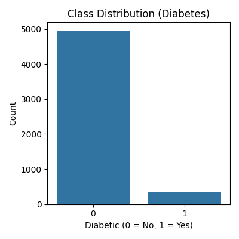
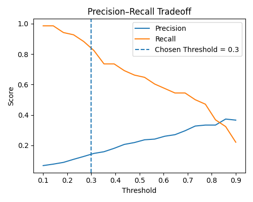
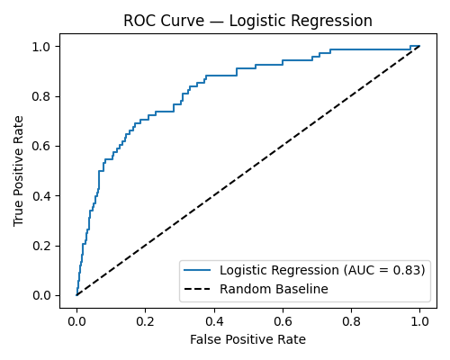
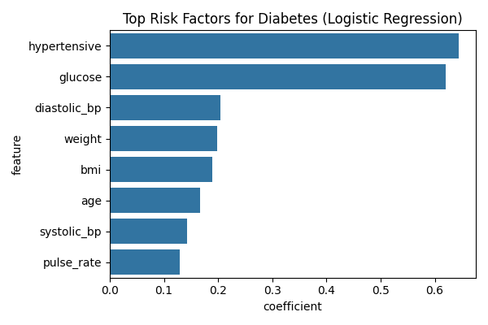

# Diabetes Risk Prediction — ML Classification with Threshold Tuning

> End-to-end ML pipeline for diabetes screening with class imbalance handling, threshold optimization, and model interpretability.

---

## Problem Statement

Predict whether a patient is diabetic (`1`) or non-diabetic (`0`) using clinical and demographic indicators.

Core challenge: **severe class imbalance** (~6.5% diabetic). Accuracy alone is misleading — this project prioritizes recall-oriented evaluation suited for medical screening.

---

## Project Structure
```
diabetes-risk-prediction/
│
├── diabetes_prediction.py    
├── diabd.csv                 
├── requirements.txt
└── outputs/
    ├── class_distribution.png
    ├── precision_recall.png
    ├── roc_curve.png
    └── feature_importance.png
```

---

## Dataset

| Property | Detail |
|----------|--------|
| Target | `diabetic` (0 = No, 1 = Yes) |
| Class split | ~93.5% Non-diabetic / ~6.5% Diabetic |
| Source | [add your dataset link here] |

**Features:** glucose, BMI, weight, age, blood pressure (systolic/diastolic), pulse rate, hypertension, cardiovascular history, family history, gender

---

## Workflow
```
Load & Validate Data → EDA → Train/Test Split → Feature Scaling
    → Logistic Regression (GridSearchCV) → Threshold Tuning
    → Feature Interpretability → Random Forest (Benchmark)
```

---

## Key Design Decisions

### Class Imbalance
- `class_weight='balanced'` on both models
- ROC-AUC as primary scoring metric, not accuracy

### Threshold Optimization
Default 0.5 threshold replaced after evaluating the precision-recall tradeoff:

| Threshold | Precision | Recall |
|-----------|-----------|--------|
| 0.20 | 0.10 | 0.94 |
| 0.30 | 0.14 | 0.84 |
| 0.40 | 0.18 | 0.72 |
| 0.50 | 0.23 | 0.65 |

**Final threshold: 0.30** — in medical screening, missing a diabetic patient is more costly than a false positive.

---

## Results

### Logistic Regression (Primary Model — Threshold = 0.30)

| Metric | Score |
|--------|-------|
| ROC-AUC | 0.83 |
| Recall (Diabetic) | 84% |
| Precision (Diabetic) | 14% |

### Random Forest (Benchmark)

| Metric | Score |
|--------|-------|
| ROC-AUC | 0.85 |
| Recall (Diabetic) | 60% |
| Precision (Diabetic) | 25% |

Logistic Regression was preferred for its balance of recall performance and interpretability.

---

## Visualizations

**Class Distribution**


**Precision–Recall Tradeoff**


**ROC Curve**


**Top Risk Factors (Logistic Regression)**


---

## Interpretability

Top risk factors identified via logistic regression coefficients:

| Feature | Importance |
|---------|------------|
| hypertensive | 0.297 |
| glucose | 0.272 |
| systolic_bp | 0.095 |
| diastolic_bp | 0.078 |
| age | 0.065 |

These align with established clinical knowledge, increasing trust in the model.

---

## Tech Stack

- Python 3.x
- pandas, numpy
- scikit-learn
- matplotlib, seaborn

---

## How to Run
```bash
pip install -r requirements.txt
python diabetes_prediction.py
```

---

## requirements.txt
```
pandas
numpy
scikit-learn
matplotlib
seaborn
```
